# Projekt: Pilgrimsvandring - St Olavsleden

++Course++: IK032A - Innovativa Digitala Lösningar (Informatics MA, Innovation through Software), - Summer 2024, MIUN
***
++**Team: Pilgrimsled**++

- Per Anebert
- Fredrik Håkansson
- Kristoffer Ivarsson
- Fredrik Johansson
- Lars Johan Oltegen

***
***
++**Table of context**++
[toc]
***
## Introduction

Projekt Pilgrimsvandring St Olav leden is an ongoing and dynamic project aimed at enhancing the experience of pilgrims traveling along the historic St Olav route. As we continue to evolve and adapt, this project integrates several innovative services to provide a comprehensive and enriching journey for all participants.

## Main Services

### 1. **Team Management**
   - Allows for the creation and management of pilgrim teams.
   - Facilitates team member tracking and coordination.

### 2. **Wanderer Path Tracking**
   - Provides real-time tracking of wanderer paths.
   - Utilizes geolocation services to ensure pilgrims are on the right track and within designated paths.

### 3. **Points of Interest**
   - Lists various points of interest along the route.
   - Provides information and guidance to enrich the pilgrim experience.

### 4. **Authentication and Security**
   - Secure login services for all users.
   - Role-based access control to ensure data integrity and privacy.

***
## Logging  and monitoring

Logging is an essential aspect of our project for monitoring and debugging. We implement different logging levels to capture various types of information. This is future functions part of the administrive platform:

- **Debug**: Detailed information, typically of interest only when diagnosing problems.
- **Info**: Confirmation that things are working as expected.
- **Warning**: An indication that something unexpected happened, or indicative of some problem in the near future (e.g., ‘disk space low’). The software is still working as expected.
- **Error**: Due to a more serious problem, the software has not been able to perform some function.
- **Critical**: A serious error, indicating that the program itself may be unable to continue running.

***
## AI Services and Future Innovations

### AI Service

The project integrates AI to enhance various functionalities:

- **Personalized guiding and recommendations**: AI analyzes user preferences and behaviors to provide personalized suggestions for points of interest and services.
- **Route optimization**: AI algorithms help in optimizing the travel routes for pilgrims, ensuring efficient and scenic paths.
- **The purpose of AI**: The AI functions must be robust and user-friendly. Be a part of creating safety and security for the hiker. 
- **AI functionality**:To access the AI services on the internet, either Post or Get requests are used, which gives a response in the form of a JSON object.

### Future innovational possibilities

- **Predictive Maintenance**: Use AI to predict and prevent potential issues along the routes, ensuring a smoother journey.
- **Augmented Reality (AR) Integration**: Enhance the pilgrim experience by overlaying historical and cultural information onto real-world views using AR.
- **Health and Wellness Monitoring**: Implement wearable technology to monitor the health and wellness of pilgrims, providing real-time feedback and support.

***
### Using the Command Line with .NET CLI:

1. **Install the .NET 8 SDK:** Download and install the .NET 8 SDK from the official Microsoft website [download .NET SDK]. This provides the necessary tools for running .NET applications.
2. **Navigate to your project directory:** Open a command prompt or terminal and navigate to the directory containing your C# project files.
3. **Restore dependencies:** Use the `dotnet restore` command to download any required libraries your project depends on.
4. **Build the project:** Use the `dotnet build` command to compile your C# code into an executable file.
5. **Run the application:**  You can use the `dotnet run` command followed by the project file name (e.g., `dotnet run Pilgrimsvandring.csproj`).
***
### Future Innovational Possibilities

- **Predictive Maintenance**: Use AI to predict and prevent potential issues along the routes, ensuring a smoother journey.
- **Augmented Reality (AR) Integration**: Enhance the pilgrim experience by overlaying historical and cultural information onto real-world views using AR.
- **Health and Wellness Monitoring**: Implement wearable technology to monitor the health and wellness of pilgrims, providing real-time feedback and support.

***

## Conclusion

Projekt Pilgrimsvandring St Olav leden is a living project, continuously adapting to provide a rich, secure, and engaging experience for all pilgrims. With the integration of advanced services and AI, we aim to push the boundaries of what’s possible, offering innovative solutions to enhance the journey along the historic St Olav route.
***
***
## Use case senario for log in levels

++**Console output log for different access token levels**++

User Coordinates - Latitude: 63,4305, Longitude: 11,3951
User Coordinates - common-path-auth
User Coordinates - Latitude: 63,1792, Longitude: 14,6357
User Coordinates - wanderer-path-auth

***
***
## Overview of models and endpoint details

***
---
Example of entity content:

Comment

***
Event

***
NatureInterests

***
Photos

***
PointsOfInterest

```plantuml
@startjson
{
    "id": 1,
    "name": "Storkyrkan",
    "category": "sevärdheter",
    "coordinates": {
      "latitude": 59.3257,
      "longitude": 18.07
    },
    "address": "Trångsund 1, 111 29 Stockholm",
    "description": "En av Stockholms äldsta kyrkor, belägen i Gamla Stan."
  }
@endjson
```

WandererPaths

***
***

**Additional Resources:**

* Tutorial: Create a .NET console application using Visual Studio Code: [https://learn.microsoft.com/en-us/dotnet/core/tutorials/with-visual-studio-code](https://learn.microsoft.com/en-us/dotnet/core/tutorials/with-visual-studio-code)
* Tutorial: Create a .NET console application using Visual Studio: [https://code.visualstudio.com/docs/csharp/get-started](https://code.visualstudio.com/docs/csharp/get-started)
